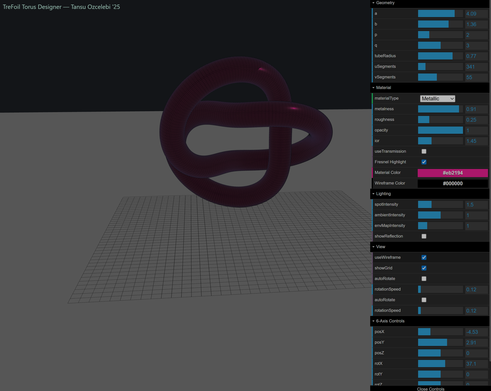
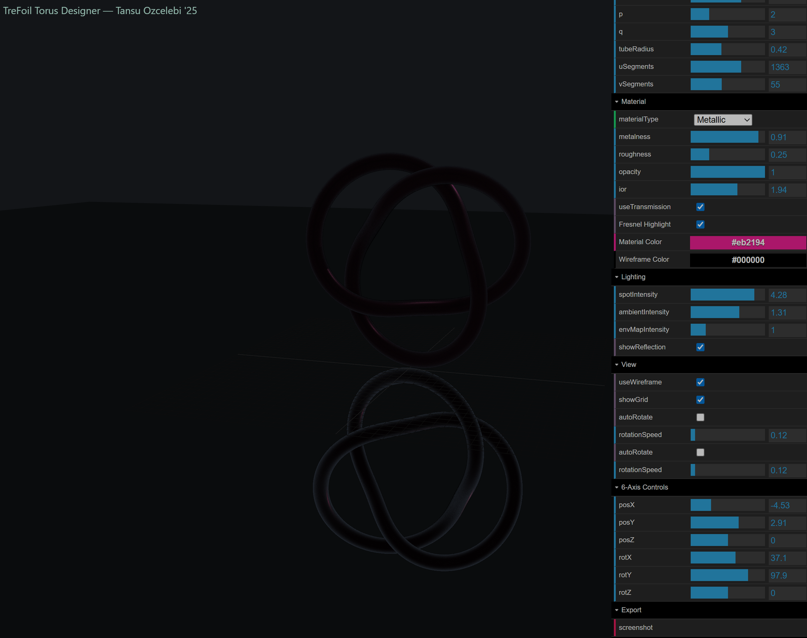

# Complex Torus Renderer by Tansu Ozcelebi

Bunu üniversitede yazmak için 2 ay uğraşmışken AI ile 2 saatte bitti.
Muazzam kaliteli ayrıca ahde edip gölgelendiriyor.



Bunlara ek olarak bilinen sorunları var. Render işi ok parametreli biliyorsunuz.




A small Vite + Three.js demo that renders a parametric trefoil-like knot with interactive controls.

Quick start (PowerShell):

```powershell
npm install
npm run dev
```

Open the URL printed by Vite (usually http://localhost:5173) in your browser.


Features:
- Parametric knot implemented as `TrefoilCurve` (see `src/trefoil.js`).
- Tube geometry via `THREE.TubeGeometry`.
- GUI controls (dat.GUI) for parameters, materials, lighting, and export.
- **Keyboard Shortcuts:**

| Key         | Action                |
|-------------|-----------------------|
| W/S         | posY up/down          |
| A/D         | posX left/right       |
| Q/E         | posZ forward/back     |
| I/K         | a increase/decrease   |
| J/L         | b decrease/increase   |
| U/O         | p decrease/increase   |
| N/M         | q decrease/increase   |

Hold Shift for larger steps (position).

Notes:
- To run:

```powershell
npm install
npm run dev
```

Open the URL printed by Vite (usually http://localhost:5173).

Tests:

```powershell
npm run test
```

To build: `npm run build` and serve the `dist` folder.

## Release v1.0.0

This repository is released as version `1.0.0`.

See `CHANGELOG.md` for the initial release notes. To publish a release:

1. Commit your changes and tag the release:

```powershell
git add .
git commit -m "chore(release): v1.0.0"
git tag v1.0.0
git push && git push --tags
```

2. Create a GitHub release from the `v1.0.0` tag and attach build artifacts if needed.
